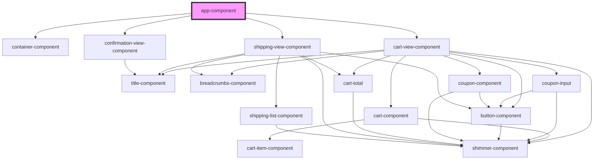

# app-component

<!-- Auto Generated Below -->

## Dependencies

### Depends on

- [container-component](../container)
- [cart-view-component](../cart-view)
- [shipping-view-component](../shipping-view)
- [confirmation-view-component](../confirmation-view)

### Graph

----------------------------------------------

*Built with [StencilJS](https://stenciljs.com/)*
