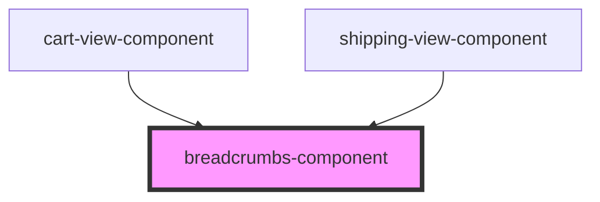

# breadcrumbs-component

<!-- Auto Generated Below -->

## Properties

| Property | Attribute | Description | Type       | Default |
| -------- | --------- | ----------- | ---------- | ------- |
| `items`  | `items`   |             | `string[]` | `[]`    |

## Events

| Event        | Description | Type                  |
| ------------ | ----------- | --------------------- |
| `routeClick` |             | `CustomEvent<string>` |

## Dependencies

### Used by

 - [cart-view-component](../cart-view)
 - [shipping-view-component](../shipping-view)

### Graph

----------------------------------------------

*Built with [StencilJS](https://stenciljs.com/)*
