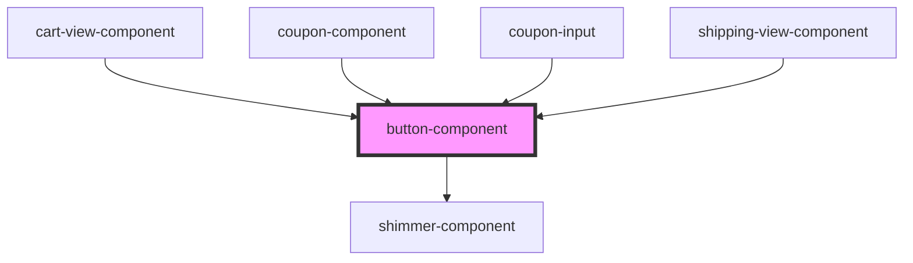

# button-component

<!-- Auto Generated Below -->

## Properties

| Property      | Attribute      | Description | Type                         | Default    |
| ------------- | -------------- | ----------- | ---------------------------- | ---------- |
| `isDisabled`  | `is-disabled`  |             | `boolean`                    | `false`    |
| `isLoading`   | `is-loading`   |             | `boolean`                    | `false`    |
| `showShimmer` | `show-shimmer` |             | `boolean`                    | `false`    |
| `variant`     | `variant`      |             | `"icon" \| "normal" \| "sm"` | `"normal"` |

## Events

| Event     | Description | Type                |
| --------- | ----------- | ------------------- |
| `onClick` |             | `CustomEvent<void>` |

## Dependencies

### Used by

 - [cart-view-component](../cart-view)
 - [coupon-component](../coupon)
 - [coupon-input](../coupon-input)
 - [shipping-view-component](../shipping-view)

### Depends on

- [shimmer-component](../shimmer)

### Graph

----------------------------------------------

*Built with [StencilJS](https://stenciljs.com/)*
