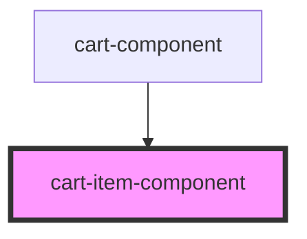

# cart-item-component

<!-- Auto Generated Below -->

## Properties

| Property | Attribute | Description | Type           | Default     |
| -------- | --------- | ----------- | -------------- | ----------- |
| `item`   | `item`    |             | `CartItemData` | `undefined` |

## Dependencies

### Used by

 - [cart-component](../cart)

### Graph

----------------------------------------------

*Built with [StencilJS](https://stenciljs.com/)*
