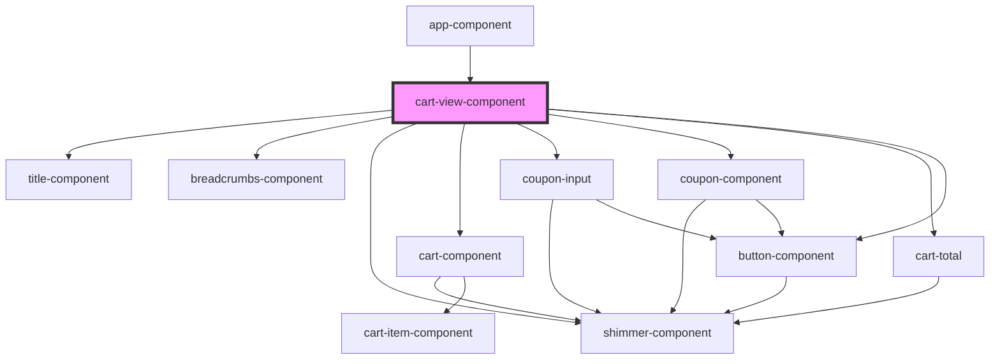

# cart-view-component

<!-- Auto Generated Below -->

## Events

| Event      | Description | Type                  |
| ---------- | ----------- | --------------------- |
| `navigate` |             | `CustomEvent<string>` |

## Dependencies

### Used by

 - [app-component](../app)

### Depends on

- [title-component](../title)
- [breadcrumbs-component](../breadcrumbs)
- [shimmer-component](../shimmer)
- [cart-component](../cart)
- [coupon-input](../coupon-input)
- [coupon-component](../coupon)
- [cart-total](../cart-total)
- [button-component](../button)

### Graph

----------------------------------------------

*Built with [StencilJS](https://stenciljs.com/)*
