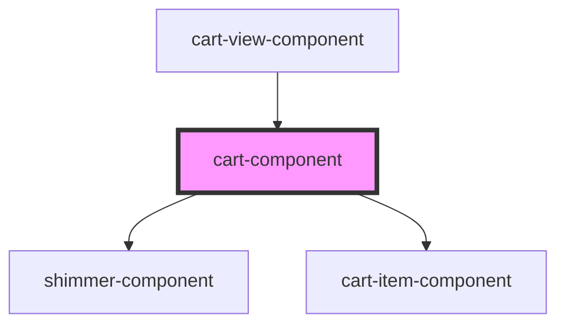

# cart-component

<!-- Auto Generated Below -->

## Properties

| Property    | Attribute    | Description | Type             | Default |
| ----------- | ------------ | ----------- | ---------------- | ------- |
| `isLoading` | `is-loading` |             | `boolean`        | `false` |
| `items`     | `items`      |             | `CartItemData[]` | `[]`    |

## Dependencies

### Used by

 - [cart-view-component](../cart-view)

### Depends on

- [shimmer-component](../shimmer)
- [cart-item-component](../cart-item)

### Graph

----------------------------------------------

*Built with [StencilJS](https://stenciljs.com/)*
