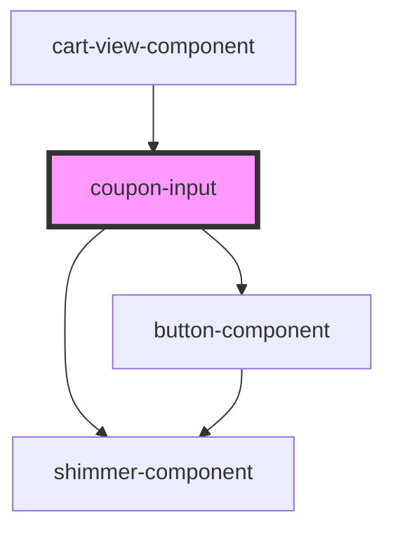

# coupon-input

<!-- Auto Generated Below -->

## Properties

| Property          | Attribute           | Description | Type      | Default         |
| ----------------- | ------------------- | ----------- | --------- | --------------- |
| `disabled`        | `disabled`          |             | `boolean` | `false`         |
| `isCouponApplied` | `is-coupon-applied` |             | `boolean` | `false`         |
| `isLoading`       | `is-loading`        |             | `boolean` | `false`         |
| `placeholder`     | `placeholder`       |             | `string`  | `"Insert Code"` |
| `value`           | `value`             |             | `string`  | `""`            |

## Events

| Event         | Description | Type                  |
| ------------- | ----------- | --------------------- |
| `applyCoupon` |             | `CustomEvent<string>` |
| `inputChange` |             | `CustomEvent<string>` |

## Dependencies

### Used by

 - [cart-view-component](../cart-view)

### Depends on

- [shimmer-component](../shimmer)
- [button-component](../button)

### Graph

----------------------------------------------

*Built with [StencilJS](https://stenciljs.com/)*
