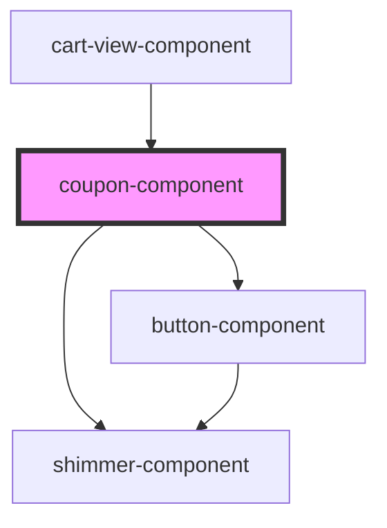

# coupon-component

<!-- Auto Generated Below -->

## Properties

| Property    | Attribute    | Description | Type         | Default     |
| ----------- | ------------ | ----------- | ------------ | ----------- |
| `coupon`    | `coupon`     |             | `CouponData` | `undefined` |
| `isLoading` | `is-loading` |             | `boolean`    | `false`     |
| `total`     | `total`      |             | `number`     | `0`         |

## Events

| Event    | Description | Type                  |
| -------- | ----------- | --------------------- |
| `delete` |             | `CustomEvent<string>` |

## Dependencies

### Used by

 - [cart-view-component](../cart-view)

### Depends on

- [shimmer-component](../shimmer)
- [button-component](../button)

### Graph

----------------------------------------------

*Built with [StencilJS](https://stenciljs.com/)*
