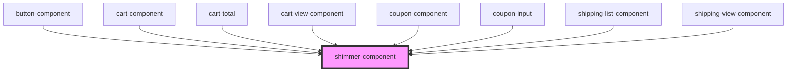

# shimmer-component

<!-- Auto Generated Below -->

## Properties

| Property | Attribute | Description | Type     | Default  |
| -------- | --------- | ----------- | -------- | -------- |
| `height` | `height`  |             | `string` | `"100%"` |
| `width`  | `width`   |             | `string` | `"100%"` |

## Dependencies

### Used by

 - [button-component](../button)
 - [cart-component](../cart)
 - [cart-total](../cart-total)
 - [cart-view-component](../cart-view)
 - [coupon-component](../coupon)
 - [coupon-input](../coupon-input)
 - [shipping-list-component](../shipping-list)
 - [shipping-view-component](../shipping-view)

### Graph

----------------------------------------------

*Built with [StencilJS](https://stenciljs.com/)*
