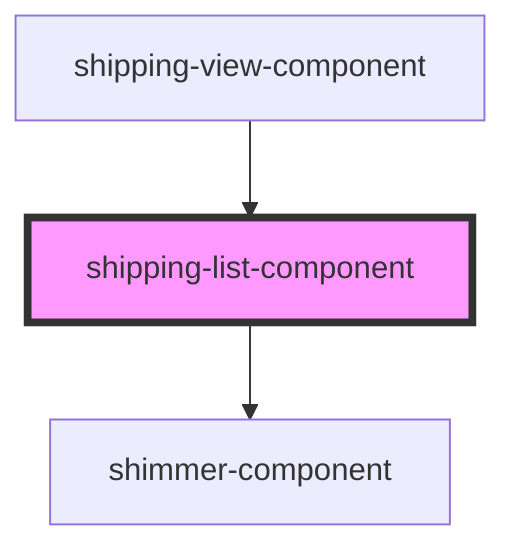

# shipping-list-component

<!-- Auto Generated Below -->

## Properties

| Property          | Attribute          | Description | Type               | Default |
| ----------------- | ------------------ | ----------- | ------------------ | ------- |
| `isLoading`       | `is-loading`       |             | `boolean`          | `false` |
| `shippingOptions` | `shipping-options` |             | `ShippingOption[]` | `[]`    |

## Events

| Event                    | Description | Type                          |
| ------------------------ | ----------- | ----------------------------- |
| `shippingOptionSelected` |             | `CustomEvent<ShippingOption>` |

## Dependencies

### Used by

 - [shipping-view-component](../shipping-view)

### Depends on

- [shimmer-component](../shimmer)

### Graph

----------------------------------------------

*Built with [StencilJS](https://stenciljs.com/)*
